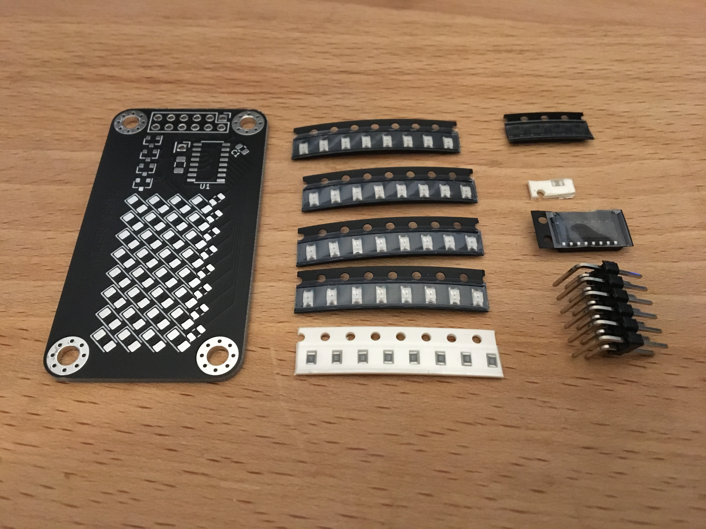
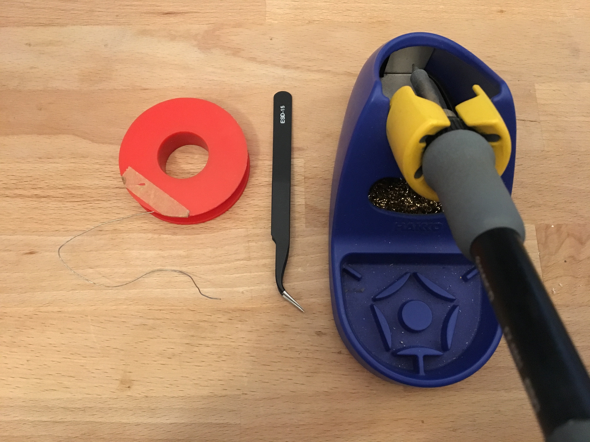
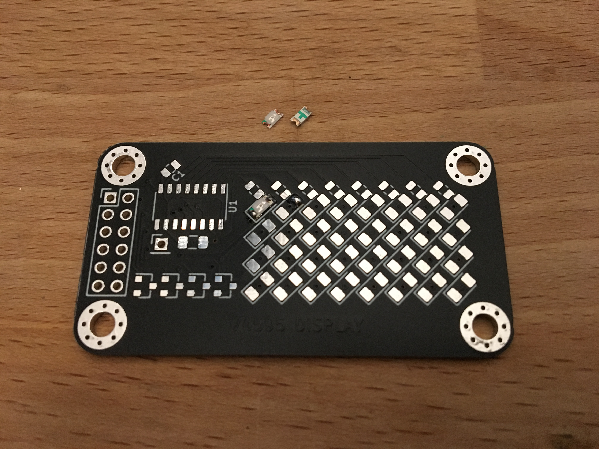
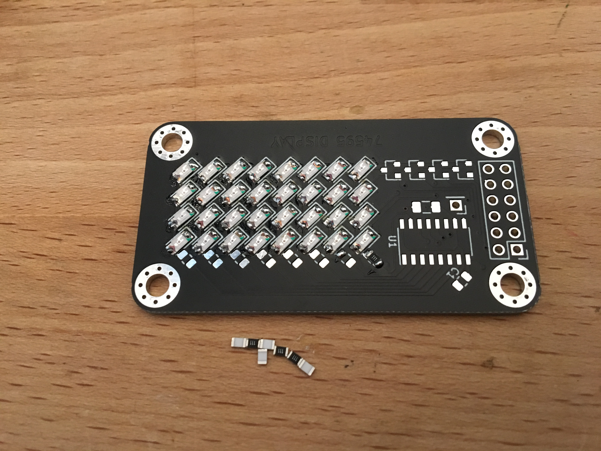
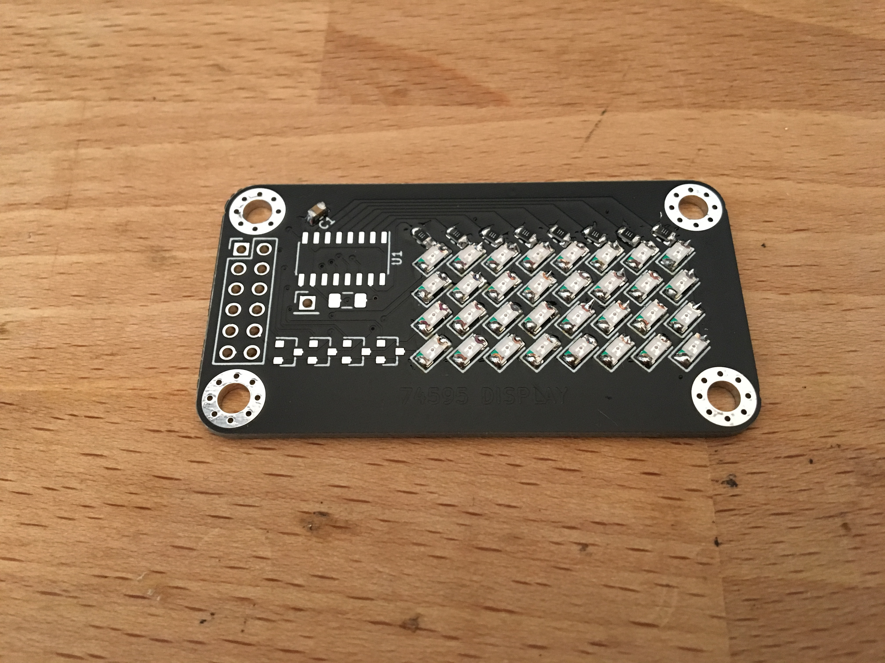
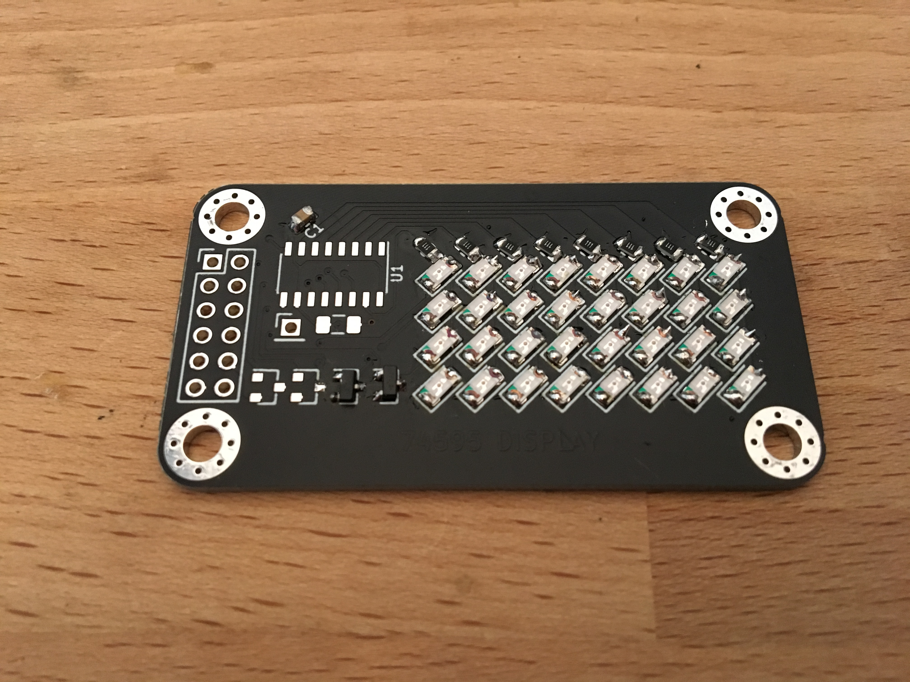
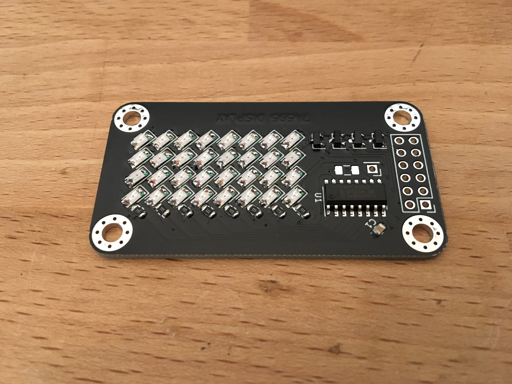
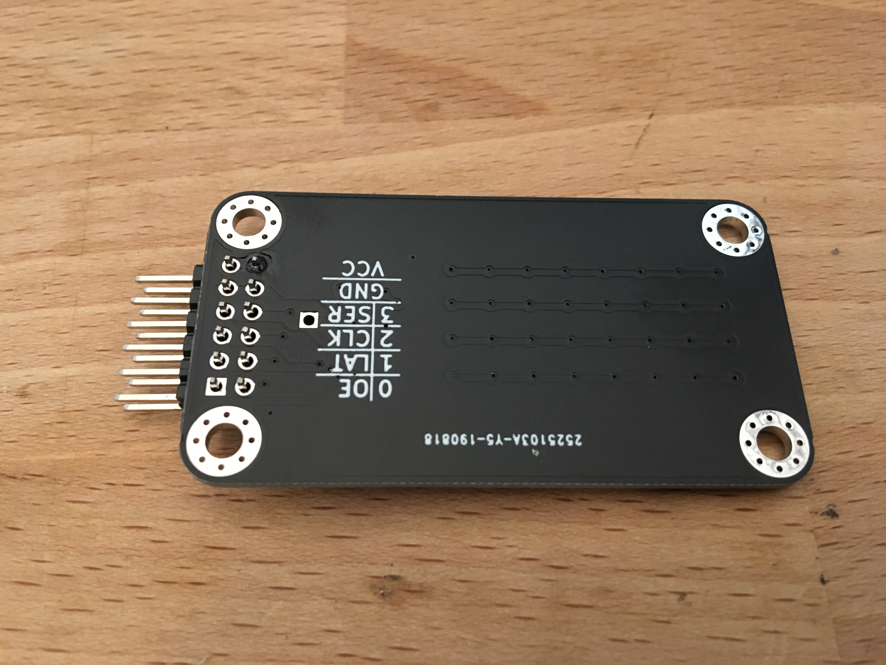
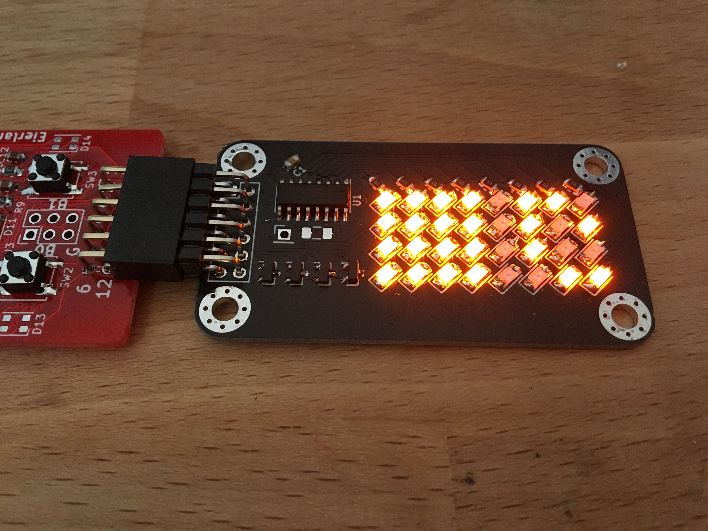

# 74595 display PMOD assembly instructions

## Introduction

This are the assembly instructions for the 74595 display PMOD. It is a led display using a shift register to drive the columns and 4 mosfets to drain the rows. Driving the display is quite similar to the large RGB led panels.

## Step 1

Check if you have all the parts.

* 32x LED
* 8x 110R resistor
* 4x 2n7002 mosfet
* 1x 100nF capacitor
* 1x 74HC595 shift register
* 1x 2x6 male angled header
* 1x PCB

You also need some tools. Reccomended are:

* Soldering Iron
* Tweezers
* Fine solder (0.5mm diameter)

## Step 2

Solder the LEDs. They should go on the large angled pads with a U shaped silkscreen. First apply solder to the pad closest to the side where you hold your soldering iron. 

The LEDs are directional. There is an arrow on the bottom and a green dot on the top of the component, this should point downward towards the white line under the pads. Solder one side and then the other.

Using your tweezers solder one of the sides of your led. When it is fixed, solder the other side. Repeat 31 times.

## Step 3

Solder the resistors. The soldering method is the same as step 2, except that the resistors are not directional, which means orientation doesnt matter.

## Step 4

Solder the capacitor to the pads marked C1. There are also pads for a larger capacitor, but tests showed that this one is not needed.

## Step 5

Solder the mosfets. The trick here is to apply solder to the single pad on one side of the mosfet and solder the other two when the component is placed.

## Step 6

Solder the 74HC595 chip. Solder pad 1 first. Pin one is marked with a dot on the chip, and a longer line at the U1 mark on the board. Make sure that the allignment of the pins is correct for all the pads. Then solder all the other pins.

## Step 7

Solder the header. First fix one pin and using a tweezer adjust alignment as needed. Then solder all the other pins.

## Step 8

Test the display. In the examples there is code for an arduino, STM32 and Icebreaker.

With the connector left, led (0,0) is top left and led (8,3) is bottom right. 

